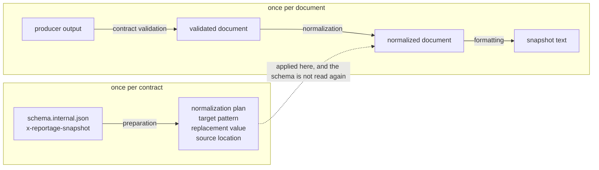

# Snapshot Normalization

JSON snapshot suites compare producer output against a committed file.
Some of that output is intentionally volatile — the tool version, the artifact root — so it must be stabilized before comparison or every snapshot would break on every release.

Snapshot normalization is that stabilization.
The policy lives in the contract schemas as `x-reportage-snapshot` annotations beside the fields they apply to, and the harness compiles those annotations into a plan it applies to each document.
Adding a volatile field to a contract therefore means annotating it beside its definition, rather than editing an instance path into every suite that snapshots it.

The reasoning, the alternatives that were rejected, and the boundaries of the supported profile are in [the normalization foundation ADR](../../adr/20260723T160117Z_json-schema-driven-snapshot-normalization-foundation.md) and [the static local reference ADR](../../adr/20260729T182026Z_static-local-reference-resolution-for-snapshot-normalization.md).
This document records what the implementation adopted: how the stages fit together, where each failure surfaces, and the decisions that were settled while building it.

## Scope

This is harness-internal.
It is implemented under [`crates/reportage-cli/tests/support/snapshot_normalization/`](../../../crates/reportage-cli/tests/support/snapshot_normalization/), it is compiled only into test targets, and nothing in the shipped `reportage` binary calls it.

That is deliberate rather than incidental: normalization replaces the real artifact root and the real tool version with placeholders, which are exactly the values a consumer of `reportage run --format=json` needs.
A consequence worth knowing before proposing a test for it is that normalization has no CLI surface, so no `.repor` scenario can observe it — there is no process to run and no output to assert against.

It is also not a general JSON Schema implementation, it never processes user-supplied schemas, and its output is not required to satisfy the schema it was normalized against.

## Model

Three things, and one boundary between them.

- An **annotation** states that one field of a contract is volatile, and what to write in its place. It lives in the schema, beside the field it is about.
- A **plan** is what a schema's annotations compile to: instructions, each naming the instance positions to rewrite, the literal to write there, and the annotation it came from. It is immutable and says nothing about any particular document.
- A **document** is one producer output. A plan applied to it yields a normalized document, which is then written as snapshot text.

The boundary is the plan.
Everything the schema has to say is decided before any document exists, and nothing downstream reads the schema again.

Preparation, contract validation, normalization, and formatting are the stages, and the arrows are the order they run in.
The boundary is what the rest of this document is mostly about: it decides where each failure can be detected, what a diagnostic is able to name, and how much work a suite of fixtures repeats.

## Why the stages are separate

Contract validation comes first because normalization is not a repair step.
A snapshot recorded from a document that never satisfied its schema would pin a contract violation as expected output.
Validation is a separate concern with its own policy; see [the JSON contract validation ADR](../../adr/20260728T092956Z_json-contract-validation-policy.md).

Preparation is separate from processing so a defect in the annotations is found once, against the schema, instead of being rediscovered against whichever fixture happened to reach it.
It also makes the per-fixture cost the cost of one walk over one document: a plan is prepared once per schema and reused for every fixture of a suite.

Formatting is separate from normalization so a snapshot diff can be read as a changed value or a changed layout, not as both at once.

## Where the policy lives

The annotated schemas are [the JSON report internal source schema](../../../spec/output/json-report/schema.internal.json) and [the artifact result internal source schema](../../../spec/artifacts/run-result/schema.internal.json).
The public `schema.json` artifacts are generated from them with the annotations stripped; see [the schema artifact generation ADR](../../adr/20260727T151234Z_json-schema-artifact-generation.md).

Which values each schema normalizes is not restated here, because it is already pinned in two places that both have to move when an annotation does.

- `annotation_locations` in [`crates/xtask/src/schema_artifacts.rs`](../../../crates/xtask/src/schema_artifacts.rs) is an exact allowlist of the pointers at which `x-reportage-snapshot` may appear. The generator refuses to produce a public schema from an internal one carrying an occurrence it does not account for, or missing one it does.
- `the_maintained_contract_schemas_prepare_to_the_annotations_they_carry` in [`snapshot_normalization.rs`](../../../crates/reportage-cli/tests/snapshot_normalization.rs) pins what preparation actually compiles from those annotations.

The first is about where annotations are; the second is about what normalization does with them.
Neither substitutes for the other, and the procedure below updates both.

## Will an annotation take effect?

An annotation means something only if preparation reaches the node carrying it, and the walk is deliberately narrow: it follows object `properties`, homogeneous array `items`, and a static local `$ref` into `$defs`, and nothing else.

Every other schema-bearing keyword is a wall.
An annotation reachable only through one is inert — no rewrite, no diagnostic, and the observed value stays in the snapshot — as is one in a `$defs` entry no supported reference reaches, down to a malformed annotation there never being inspected at all.
Widening the walk is tracked by [#163](https://github.com/tooppoo/reportage/issues/163), [#164](https://github.com/tooppoo/reportage/issues/164), and [#165](https://github.com/tooppoo/reportage/issues/165); the foundation ADR lists what is currently outside it and argues why leaving those values visible is preferable to guessing at them.

Inertness is a decided behavior for an arbitrary schema, but for the two maintained contract schemas it would be a defect: the annotation would look applied while the volatile value stayed in the snapshot.
`every_annotation_in_the_maintained_contract_schemas_is_reachable` fails on one.

Inertness is also the milder failure.
Some forms are rejected outright when the walk reaches them, because continuing past them would mean guessing — `prefixItems` is the one an unrelated edit is most likely to introduce, since it makes `items` describe only the elements after the tuple prefix rather than all of them.
A rejection fails preparation for the whole schema, and therefore every suite that normalizes with it, whether or not the offending subtree had anything to do with an annotation.
The foundation ADR lists the forms this profile refuses.

## Failure categories

Four categories are distinguished.
Two are types; two are the shape of the failure at the point it is raised.

| Category | Raised by | Carries |
| --- | --- | --- |
| Schema preparation error | `prepare`, before any document is seen | the schema location of the offending keyword, and for a conflict every contributing annotation |
| Normalization application error | `apply`, against one document | the concrete instance pointer reached, the instruction's target pattern, and the source schema location |
| Snapshot mismatch | the suite's `assert_eq!` | the fixture and the command that refreshes its snapshot |
| Harness internal error | the suite's file I/O | the snapshot path that could not be read or written |

The last two carry no dedicated type.
The ADR requires the categories to be distinguishable, and each is already identifiable from where it is raised and what it says; a type would add nothing a reader of the failure needs.

An application error names two locations because either can be the thing to fix.
The instance pointer says which position of which document disagreed with the plan; the source schema location says which annotation asked for it.
With only one of them a reader cannot tell whether the document or the annotation is wrong.

## Decisions the implementation settled

These go beyond what the foundation ADR fixed, and are recorded here rather than as new ADRs because each stays inside the boundaries that ADR already drew.

### Instructions that reach one location must agree

Several annotations can name the same instance positions.
Asking for the same rewrite is one request written more than once, so one instruction survives, carrying the first source the traversal reached — the requests are indistinguishable, so any of them would be as true.
Asking for different rewrites is a defect rather than a precedence question: nothing about schema member order or traversal order is allowed to decide which annotation wins.

A conflict therefore names every annotation that reached the location instead of singling one out, because each is defensible alone and the repair is a choice between them.
They are reported once each and in pointer order, and the location the diagnostic leads with is the smallest of them, so what a reader is shown does not depend on how the instructions happened to be collected.
One schema node reached by two paths is one edit site and appears once.

### A schema with several conflicts reports one of them

The first in collection order, the way the walk stops at the first defect it reaches.
Which one that is does depend on collection order, but that is a choice about reporting and not about precedence — no annotation ever wins a conflict.

### Application fails on the first instruction it cannot apply

Instructions are applied in place to one document, so a target that is an ancestor of another target is not independent of it.
Ordering still cannot change whether normalization succeeds: a replacement writes a scalar, so any instruction reaching through a replaced position fails its next step, and an ancestor that could not be replaced was a container, which fails too.
Ordering decides only which failure is reported.

### A `null` container on the path to a target is an error

It is not a second missing-property no-op.
A property the document does not have is the optional-property case the schema's `required` already governs.
A `null` where an object was expected is a shape the plan and the document disagree about, and instance processing cannot read `type` to tell a contract-legal `null` from an illegal one — skipping it would leave a volatile value in the snapshot with nothing saying why.

### Instance positions have two types

An instruction's target is a pattern: a segment for "every element of this array" denotes a set of positions, so it is not a JSON Pointer.
What the walk actually reached is one position of one document, and is a pointer.
A diagnostic about a document needs the second, because "an element of `/tests` has the wrong shape" does not say which one.
Both render the instance root the same way, and deliberately not the way a schema location renders the document root, so a message printing both does not give them one name.

### Object key ordering is sorted explicitly

The sort looks redundant, because `serde_json::Map` is a `BTreeMap` in this build and pretty-printing therefore already emits sorted keys.
It is not: the `preserve_order` feature swaps in an insertion-ordered `IndexMap`, and any normal or dev dependency of the crates built together can enable it, which would otherwise reorder every snapshot in the repository.
The ADR requires the ordering to be explicit for this reason.

### Each suite holds its own prepared plan

The alternative is hanging it off the shared contract type in [`support/json_schema.rs`](../../../crates/reportage-cli/tests/support/json_schema.rs).
That would require the contract module to include the normalization module, and the test targets that already include both would then hold two unrelated copies of it with incompatible types.
Avoiding that needs a convention nothing enforces, which is worse than a few lines that differ per contract anyway.

## Tests

| Target | Establishes |
| --- | --- |
| [`snapshot_normalization.rs`](../../../crates/reportage-cli/tests/snapshot_normalization.rs) | schema preparation: reference resolution, the traversal profile, annotation parsing, instruction merge, and preparation diagnostics |
| [`snapshot_normalization_application.rs`](../../../crates/reportage-cli/tests/snapshot_normalization_application.rs) | instance processing: replacement rules, shape failures, and application diagnostics |
| [`snapshot_formatting.rs`](../../../crates/reportage-cli/tests/snapshot_formatting.rs) | the formatting contract, mostly as exact output text |
| [`json_report_fixtures.rs`](../../../crates/reportage-cli/tests/json_report_fixtures.rs) and [`run_result_fixtures.rs`](../../../crates/reportage-cli/tests/run_result_fixtures.rs) | that real producer output normalizes, against the real schemas |

The three dedicated targets are separate because a failure in each means something different: a schema defect, a document defect, and a layout change.

Duplicate and conflicting instructions are exercised over hand-built instructions rather than over a schema.
The traversal profile gives each instance location exactly one schema path, so no document can currently produce two instructions for one location; the policy is stated ahead of the keywords that will reach it.

Each fixture suite also asserts the replacement on a normalized document, not only through its snapshots.
The snapshots alone leave one hole: refreshing them while normalization was doing nothing would record the observed values and stay green until the tool version changed.

## Adding a volatile field

1. Annotate the field in the internal source schema, beside its definition.
2. Add the annotation's pointer to that contract's `annotation_locations` in [`crates/xtask/src/schema_artifacts.rs`](../../../crates/xtask/src/schema_artifacts.rs). Skipping this does not merely leave the list stale: generation fails until the allowlist accounts for the occurrence.
3. Regenerate the public artifacts with `just schema-artifacts-gen`.
4. Update the expectation in `the_maintained_contract_schemas_prepare_to_the_annotations_they_carry`.
5. Refresh the affected snapshots with `UPDATE_JSON_REPORT_SNAPSHOTS=1` or `UPDATE_RUN_RESULT_SNAPSHOTS=1`, and review the diff.

If the annotation is somewhere the traversal does not reach, step 4 fails rather than the snapshot silently keeping the volatile value.
